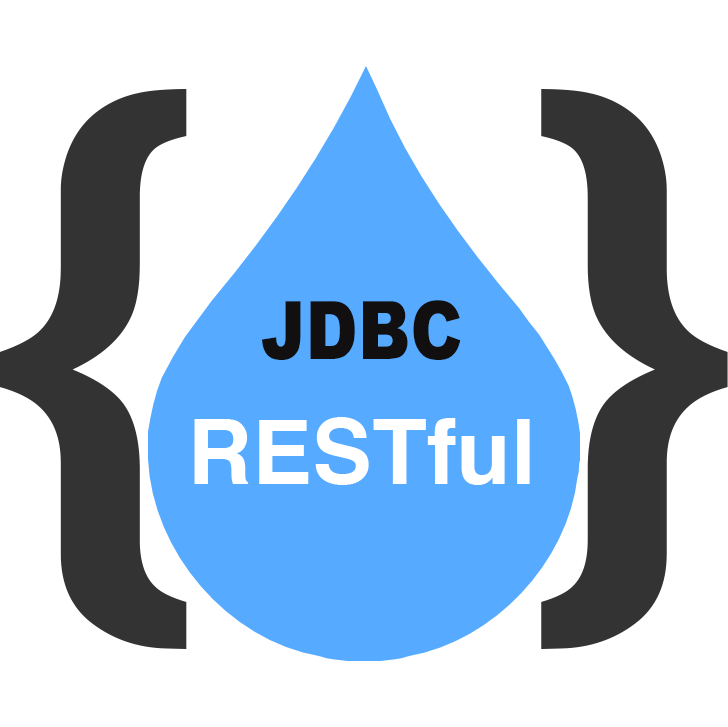

# JDBC转REST服务



这是一个JDBC转REST服务的实现，类似于`pRest/postgrest`等工具。

> 本工具旨在利用JDBC通用数据库的能力完成不同数据库转`RestFul`服务，确保高性能、规范化、安全可靠的原型接口低代码实现。

## 1、数据查询

## 1.1、从数据分页查询开始

- 请求方式：`GET`
- 接口地址：/jdbc/rest/api/tables/&lt;表名&gt;
- 请求参数：
- 请求参数：

| 参数名称              | 参数类型  | 是否必须 | 缺省值 | 传参方式 | 参数说明 |
| -------------------- | ------- | ------- | ----------- | --------------- | ----------------------- |
| offset               | 数值     |  否     | 0          | QueryString | 返回记录开始索引值             |
| limit                | 数值     |  否     | 0          | QueryString | 最大返回数量值<br>不能超过1000   |
| _select              | 字符串   |  否     |          | QueryString | 查询字段，格式为：<br>字段1,字段2,字段3,字段4<br>sum:字段1,avg:字段2,max:字段3,min:字段4->>别名1  |
| _distinct              | 字符串   |  否     | true       | QueryString   | 为true时表示排除重行  |
| _groupby              | 字符串   |  否     |         | QueryString  | 分组查询，格式为：<br>分组字段->>having:sum:test:$gt:12$integer<br>分组字段  |
| _join              | 字符串   |  否     |         | QueryString  | 关联表参数，格式为：<br>关联表名:字段名:主表字段  |
| _order              | 字符串   |  否     |          | QueryString | 字段排序，格式为：<br>-字段1,字段2  |
| _count              | 字符串   |  否     | *        | QueryString  | 统计数量，格式为：字段名  |
| _result.signleton   | 布尔   |  否     | true       | QueryString   | 为true时表示对象数据返回  |
| _result.row_struct   | 枚举   |  否     | map        | QueryString  | 可选值：<br>list表示列表<br>map表示对象  |
| _result.contain_meta | 布尔     |  否     | true     | QueryString   | 为true时在信封中返回数据元信息 |
| _result.column       | 字符串数组 |  否     |         | QueryString    | 可多个，用户设置返回字段或字段返回类型 |
| _result.total       | 布尔 |  否     | true          | QueryString  | 是否返回统计，limit为0时自动计算 |
| _result.all_column   | 布尔     |  否     | true     | QueryString   | 为true时返回所有字段数据，<br>否则由_result.column参数指定返回    |
| _result.column.&lt;field&gt;.type | 枚举  |  否     | raw    | QueryString   | 可选值：<br>raw表示保留Jdbc原值<br>map表示转换为对象值<br>list表示转换为列表值<br>base64表示转换为Base64编码值          |
| _result.column.&lt;field&gt;.alais | 字符串  |  否     |      | QueryString  | 设置指定的字段返回为其他名称          |
| &lt;field&gt;[$&lt;type&gt;] | 字符串  |  否     |       | QueryString | 字段名格式：字段名$JDBC类型<br>值格式：条件操作符[.&lt;值&gt;]          |

**条件操作符说明**

> 条件操作符借鉴自`pRest`

| 操作符               | 说明 | 示例 |
| -------------------- | ---------------------- | --------------------- |
| $eq     | 等于 | name=$eq.abc, value$integer=$eq.4 |
| $gt | 大于 | value$float=$gt.3 |
| $gte | 大于等于 | value$integer=$gte.4 |
| $lt | 小于 | value$integer=$lt.4 |
| $lte | 小于等于 | value$integer=$lte.4 |
| $ne | 不等于 | value$integer=$ne.4, name=$ne.abc |
| $in | 在..内 | value=$in.abc,1234 |
| $nin | 不在..内 | value=$nin.abc,1234 |
| $isnull | 为空 | value=$isnull |
| $notnull | 不为空 | value=$notnull |
| $istrue | 为真 | value=$istrue |
| $nottrue | 不为真 | value=$nottrue |
| $isfalse | 为假 | value=$isfalse |
| $notfalse | 不为假 | value=$notfalse |
| $like | 包含字符串，区分大小写 | value=$like.test%25，<br>其中%25代表% |
| $ilike | 包含字符串，不区分大小写 | value=$ilike.test%25 |
| $nlike | 不包含字符串，区分大小写 | value=$nlike.test%25 |
| $nilike | 不包含字符串，不区分大小写 | value=$nilike.test%25 |
| $between | 在..之间 | value=$between.1,4 |

- 应答格式：

**默认分页返回**

```json
{
  "code": 0, // 响应代码，成功为0，其他为失败
  "message": "string", // 响应信息，如：操作成功
  "data": { // 分页数据对象
    "total": 6, // 请求参数_result.total为true时返回
    "offset": 0,
    "data": [ // 数据行列表
      ..., // 数据行对象或数组
      ..., // 请求参数_result.row_struct为map时数据行为对象方式：{...}
      ..., // 请求参数_result.row_struct为list时数据行为数组方式：[...]
    ] 
  },
  "meta": { // 数据元信息，请求参数“_result.contain_meta”为true时存在
    "primary_key": "sno", // 主键名称
    "row_key": "sno", // 行键名称，如果无主键则使用第一个唯一索引
    "unique_indexs": [ // 唯一索引
      { // 索引对象
          "name": "student_pk", // 索引名称
          "unique": true, // 是否唯一
          "order": "A", // 排序方式
          "type": 3 // 类型ID
      }
    ]
    "columns": [ // 字段信息列表
      { // 字段信息
        "index": 0, // 字段索引，从0开始
        "name": "id", // 字段名，如果字段设置了别名，这里将返回别名
        "label": "id", // 字段标签
        "sql_type": "uuid", // SQL中的类型
        "jdbc_type": "OTHER", // JDBC类型
        "display_size": 2147483647, // 显示大小
        "precision": 2147483647, // 精度
        "scale": 0, // 刻度
        "read_only": false, // 是否只读
        "writable": true, // 是否可写
        "auto_increment": false, // 是否自增
        "searchable": true, // 是否可查询
        "currency": false, // 是否货币
        "nullable": false, // 是否为空
        "case_sensitive": false, // 是否区分大小写
        "table_name": "table" // 字段所属表名
      },
      ... // 多个字段
    ],
    "table_name": "routes", // 第一个字段所属表名，可为空
    "column_count": 22, // 查询返回的字段数量
  }
}
```

**统计数量返回**

> 请求包含统计数量(_count)参数时。

```json
{
  "code": 0, // 响应代码，成功为0，其他为失败
  "message": "string", // 响应信息，如：操作成功
  "data": 0 // 返回数量
}
```

**分组统计返回**

> 请求包含分组(_groupby)参数时。

```json
{
  "code": 0, // 响应代码，成功为0，其他为失败
  "message": "string", // 响应信息，如：操作成功
  "data": [ // 分组列表
    ... // 分组数据
  ] 
}
```

**对象数据返回**

> 请求包含对象数据返回(_result.signleton)参数时。

```json
{
  "code": 0, // 响应代码，成功为0，其他为失败
  "message": "string", // 响应信息，如：操作成功
  "data": { // 对象数据
    ...
  }
}
```

> 仅返回单一对象数据。

- 查询示例

```bash
curl "http://localhost:7188/jdbc/rest/api/tables/mytable"
```

> 使用`POST`方式请求`/jdbc/rest/api/query`与本接口能力等同。

## 1.2、通过主键查询数据

- 请求方式：`GET`
- 接口地址：/jdbc/rest/api/tables/&lt;表名&gt;/&lt;主键&gt;
- 请求参数：`QueryString`、`Header`
- 请求参数：

| 参数名称              | 参数类型  | 是否必须 | 缺省值  | 传参方式 | 参数说明 |
| -------------------- | ------- | ------- | ----------- | ------------- | ----------------------- |
| 表名               | 字符串     |  是     |            | Path | 指定的数据表             |
| 主键               | 字符串     |  是     |            | Path| 数据行主键<br>格式：字段名$表达式.$JDBC类型 |
| _result.row_struct   | 枚举   |  否     | map         | QueryString | 可选值：<br>list表示列表<br>map表示对象  |
| _result.contain_meta | 布尔     |  否     | false     | QueryString   | 为true时在信封中返回数据元信息 |
| _result.all_column   | 布尔     |  否     | true      | QueryString  | 为true时返回所有字段数据，<br>否则由_result.column参数指定返回    |
| _result.column       | 字符串数组 |  否     |          | QueryString   | 可多个，用户设置返回字段或字段返回类型 |
| _result.column.&lt;field&gt;.type | 枚举  |  否     | raw    | QueryString   | 可选值：<br>raw表示保留Jdbc原值<br>map表示转换为对象值<br>list表示转换为列表值<br>base64表示转换为Base64编码值          |
| _result.column.&lt;field&gt;.alais | 字符串  |  否     |      | QueryString  | 设置指定的字段返回为其他名称          |
| jdbcrest-primary-key | 字符串  | 否 |       | Header | 请求头参数，自定义主键字段         |
| jdbcrest-key-splitter | 字符串  | 否 |       | Header | 请求头参数，自定义主键分割符，默认为`\|`         |

- 应答格式：

**对象格式**

> 请求参数_result.row_struct为map时：

```json
{
  "code": 0,
  "message": "调用成功!",
  "data": { // 数据对象
    ... // 属性
  }
}
```

**对象格式**

> 请求参数_result.row_struct为list时：

```json
{
  "code": 0,
  "message": "调用成功!",
  "data": [ // 数据列数组
    ... // 属性
  ]
}
```

## 1.3、统计查询数据行

- 请求方式：`GET`
- 接口地址：/jdbc/rest/api/tables/&lt;表名&gt;?_count
- 应答格式：

```json
{
  "code": 0,
  "message": "调用成功!",
  "data": 1234 // 数据行总量
}
```

## 2、数据插入

- 请求方式：`POST`活`PUT`
- 接口地址：/jdbc/rest/api/tables/&lt;表名&gt;
- 请求参数：`JSON`、`FormData`

**单行数据插入**

```json
{ // 数据对象
  ... // 属性
}
```

**多行数据插入**

```json
[
  { // 数据对象1
    ... // 属性
  },
  ... // 更多的数据
]
```

- 应答格式：

**单行数据插入应答**

```json
{
  "code": 0,
  "message": "调用成功!",
  "data": 1 // 插入
}
```

**多行数据插入应答**

```json
{
  "code": 0,
  "message": "调用成功!",
  "data": [
    1,... // 插入
  ] // 插入
}
```

有自增字段的应答：

```json
{
  "code": 0,
  "message": "调用成功!",
  "data": [
    [1,...] // 插入数量
    [自增序号,...] // 自增序号列表
  ] // 插入
}
```

## 3、修改数据

## 3.1、根据主键更新数据

> 全字段修改，未传入的字段设置为NULL。

- 请求方式：`POST`
- 接口地址：/jdbc/rest/api/tables/&lt;表名&gt;/&lt;主键&gt;
- 请求参数：

| 参数名称              | 参数类型  | 是否必须 | 缺省值 | 传参方式 | 参数说明 |
| -------------------- | ------- | ------- | ----------- | ----------- | ----------------------- |
| 表名               | 字符串     |  是     |            | Path | 指定的数据表             |
| 主键               | 字符串     |  是     |            | Path | 指定的主键             |
| jdbcrest-primary-key  | 字符串     |  是     |            | Header | 主键字段名             |
| jdbcrest-key-splitter  | 字符串     |  是     |            | Header | 符合主键分隔符             |
| 更新内容            | 对象     |  是     |            | JSON或FormData | 更新内容             |

- 应答格式：`JSON`

```json
{
  "code": 0,
  "message": "调用成功!",
  "data": 0 // 更新记录数
}
```

## 3.2、根据主键补丁更新

> 根据传入字段修改，未传入的字段不变。

- 请求方式：`PATCH`
- 接口地址：/jdbc/rest/api/tables/&lt;表名&gt;/&lt;主键&gt;
- 请求参数：

| 参数名称              | 参数类型  | 是否必须 | 缺省值 | 传参方式 | 参数说明 |
| -------------------- | ------- | ------- | ----------- | ----------- | ----------------------- |
| 表名               | 字符串     |  是     |            | Path | 指定的数据表             |
| 主键               | 字符串     |  是     |            | Path | 指定的主键             |
| jdbcrest-primary-key  | 字符串     |  是     |            | Header | 主键字段名             |
| jdbcrest-key-splitter  | 字符串     |  是     |            | Header | 符合主键分隔符             |
| 更新内容            | 对象     |  是     |            | JSON或FormData | 更新内容             |

- 应答格式：`JSON`

```json
{
  "code": 0,
  "message": "调用成功!",
  "data": 0 // 更新记录数
}
```

## 3.3、批量更新数据行

> 根据传入字段修改，未传入的字段不变。

- 请求方式：`PATCH`
- 接口地址：/jdbc/rest/api/tables/&lt;表名&gt;
- 请求参数：

| 参数名称              | 参数类型  | 是否必须 | 缺省值 | 传参方式 | 参数说明 |
| -------------------- | ------- | ------- | ----------- | ----------- | ----------------------- |
| 表名               | 字符串     |  是     |            | Path | 指定的数据表             |
| 主键               | 字符串     |  是     |            | Path | 指定的主键             |
| jdbcrest-&lt;field&gt;[$&lt;type&gt;]    | 字符串     |  是     |            | Header | 字段名格式：<br>字段名$JDBC类型<br>值格式：操作符[.&lt;值&gt;]              |
| 更新内容            | 对象     |  是     |            | JSON或FormData | 更新内容             |

- 应答格式：`JSON`

```json
{
  "code": 0,
  "message": "调用成功!",
  "data": 0 // 更新记录数
}
```

## 4、删除数据

## 4.1、根据主键删除数据

- 请求方式：`DELETE`
- 接口地址：/jdbc/rest/api/tables/&lt;表名&gt;/&lt;主键&gt;
- 请求参数：

| 参数名称              | 参数类型  | 是否必须 | 缺省值 | 传参方式 | 参数说明 |
| -------------------- | ------- | ------- | ----------- | ----------- | ----------------------- |
| 表名               | 字符串     |  是     |            | Path | 指定的数据表             |
| 主键               | 字符串     |  是     |            | Path | 指定的主键             |
| jdbcrest-primary-key  | 字符串     |  是     |            | Header | 主键字段名             |
| jdbcrest-key-splitter  | 字符串     |  是     |            | Header | 符合主键分隔符             |

- 应答格式：`JSON`

```json
{
  "code": 0,
  "message": "调用成功!",
  "data": 0 // 删除记录数
}
```

## 4.2、批量删除数据行

- 请求方式：`DELETE`
- 接口地址：/jdbc/rest/api/tables/&lt;表名&gt;
- 请求参数：

| 参数名称              | 参数类型  | 是否必须 | 缺省值 | 传参方式 | 参数说明 |
| -------------------- | ------- | ------- | ----------- | ----------- | ----------------------- |
| &lt;field&gt;[$&lt;type&gt;] | 字符串  |  否     |       | QueryString | 字段名格式：字段名$JDBC类型<br>值格式：操作符[.&lt;值&gt;]          |


- 应答格式：`JSON`

```json
{
  "code": 0,
  "message": "调用成功!",
  "data": 0 // 删除记录数
}
```

## 5、批量操作

- 请求方式：`POST`
- 接口地址：/jdbc/rest/api/dml
- 请求参数：

| 参数名称              | 参数类型  | 是否必须 | 缺省值 | 传参方式 | 参数说明 |
| -------------------- | ------- | ------- | ----------- | ----------- | ----------------------- |
| Request Body | 操作请求数组  |  否     |       | JSON | 多个操作请求         |

**操作请求**

```json
{
  "insert": [ // 插入请求列表
    { // 插入请求对象
      "table_name": "表名",
      "input_data": { // 可以是数组或对象
        ... // 数据对象
      }
    }
  ],
  "update": [ // 更新请求列表
    { // 更新请求对象
      "table_name": "表名",
      "input_data": { // 可以是数组或对象
        ... // 更新数据
      },
      "where": [
        {
          "column": "字段名", // 字段名
          "condition": { // 条件
            "operation": "$eq", // 条件操作符，具体参见分页查询条件操作符说明
            "value": "ddb79978-0a82-47f4-8a6e-b714442cca53" // 条件值，对象或数组
          }
        },
        ... // 多个条件与关系
      ]
    }
  ],
  "delete": [ // 删除请求列表
    {
      "table_name": "表名",
      "where": [
        {
          "column": "字段名", // 字段名
          "condition": { // 条件
            "operation": "$eq", // 条件操作符，参见分页查询条件操作符说明
            "value": "ddb79978-0a82-47f4-8a6e-b714442cca53" // 条件值，对象或数组
          }
        },
        ... // 多个条件与关系
      ]
    }
  ]
}
```

- 应答格式：`JSON`

```json
{
  "code": 0,
  "message": "调用成功!",
  "data": [
    { // 应答对象
      "insert": [ // 插入操作记录数
        0, ...
      ],
      "update": [ // 更新操作记录数
        0, ...
      ],
      "delete": [ // 删除操作记录数
        0, ...
      ]
    },
    ... // 更多应答
  ]
}
```

## 6、SQL实现服务

启动运行时设置`SQL_LOCATION`环境变量为一个目录地址(如：`file://xxx/path`)，如此您可以在该目录下放置`SQL`文件用于实现REST服务，规则如下：

- 后缀为`.sql`的`xxx`文件都对应一个`/jdbc/rest/api/services/xxx`地址；
- `SQL`实现服务只能使用`POST`方法调用；
- 请求必须通过`JSON`方式传入请求参数；

`SQL`文件可以是任何增删改查语句，可定义多段`SQL`，默认返回最后一段查询结果，示例如下所示：

```SQL
/*
################################################
# 定义返回格式(YAML格式)
################################################

# 是否单行返回，默认为false
signleton: false

# 单行返回且只有一个字段则只返回字段内容，默认为false
column_compact: false

# 字段定义，主要是为了
#columns:
#- name: <字段名>
#  type: raw, map, list, base64

################################################
*/
select * from score offset #{input.offset, jdbcType=INTEGER} limit 100;
```

**注释说明**

> 注释部分使用`YAML`格式定义查询返回

**`SQL`部分**

> 使用与`MyBatis`一样传参定义方式，其中`input`表示请求传入的参数主体，`user`表示登录用户信息（需要开启前端扩展功能），`req`表示当前请求信息。

- user
  - user_id 用户ID
  - user_name 用户名
  - display_name 显示名称
  - idcard 身份证
- req
  - time 请求时间戳
  - client_ip 客户端IP

**类型处理**

- com.snz1.jdbc.rest.dao.ListTypeHandler 列表参数转字段
- com.snz1.jdbc.rest.dao.MapTypeHandler  对象参数转字段
- com.snz1.jdbc.rest.dao.Base64TypeHandler  Base64参数转`Blob`、`CLOB`字段

## 7、高级扩展功能

扩展功能包括前端扩展功能及数据表接口扩展配置功能。

### 7.1、前端扩展功能

> 设置`SSO_ENABLED`环境变量为`true`时表示启用前端单点登录扩展功能，此时可以启用权限定义及权限控制配置。

启用前端单点登录后，默认只能通过用户身份访问`jdbcrest`数据服务接口，除非进行特别的权限配置。

#### 7.1.1、配置数据接口访问权限


通过设置环境变量`SERVICE_AUTHORIZE`指定文件地址(如:`file://xxxx/service-authorize.yaml`)则可以为`jdbcrest`数据服务接口设置用户访问权限，配置文件示例如下所示：

```yaml

# 所有路径要求登录
- path: /**
  # Spring的SPEL表达式，isAuthenticated表示要求登录
  access: isAuthenticated

# 测试权限
- path: /student/**
  access: hasRole('jdbcrest_test')

# 心跳检查
- path: /health/**
  # 请求方法，缺省为全部
  method: GET
  # Spring的SPEL表达式，permitAll表示向所有人开放（包括匿名）
  access: permitAll

# 文档资源
- path: /v2/**
  access: permitAll
- path: /swagger/**
  access: permitAll
- path: /swagger-resources/**
  access: permitAll
- path: /swagger-ui/**
  access: permitAll
- path: /webjars/**
  access: permitAll
- path: /version
  access: permitAll

```

> 服务访问权限主要是通过配置文件中的`Spring`的`SPEL`表达式实现，具体参见`SpringSecurity`注解式安装拦截配置。

#### 7.1.2、前端功能权限树定义

> 通常为了实现一个前端应用我们需要配合前端输出用户可见权限的功能树，因此这个配置功能是为了实现前后端一致的功能权限控制。

通过设置环境变量`PERMISSION_DEFINITION`指定文件地址(如:`file://xxxx/permission-definition.yaml`)则可以为`jdbcrest`
应用配置功能权限树，其主要结构示例如下所示：

```yaml
# 启动时候是否自动化配置
enabled: true

# 设置当前配置版本，
# 如果当前版本大于与已配置版本则自动重新配置
version: 2

# 配置默认用户
organizations:
- name: 开发团队
  children:
  - name: 默认管理员
    employeeid: '9527'
    groups:
    - all
    password: ${app.admin.default.password:changeme}
    user_name: ${app.admin.default.username:root}
  # 组织代码
  code: developer
  # 组织类型
  type: organization

# 角色分组
groups:
  # 分组代码
- code: test
  # 分组名称
  name: 测试分组
  # 该组拥有的权限
  roles:
  - jdbcrest_test

# 功能树配置
functions: 
# 应用名称
- name: JDBC转REST
  # 应用名称
  code: jdbcrest
  # 应用类型必须为app
  function_type: app
  # 权限代码
  rolecode: jdbcrest
  # 子节点，任何一个节点都可以有子节点
  children: 
    # 子节点名称
  - name: 系统概况
    # 子节点代码
    code: jdbcrest
    # 节点类型：
    # module表示模块或子模块
    # unit表示功能单元
    # action表示操作
    # data表示数据
    function_type: unit
    # 权限代码，表示拥有此权限代码的用户才能使用
    rolecode: jdbcrest
  - name: 测试菜单
    code: jdbcrest.test
    function_type: unit
    rolecode: jdbcrest_test

# 权限列表
roles: 
  # 权限名称
- name: 访问JDBC转REST系统
  # 权限代码
  # 授予用户则表示用户拥有访问某功能权限
  code: jdbcrest
- name: 访问测试菜单
  code: jdbcrest_test
```

>前端功能权限树定义后可以通过`/jdbc/rest/api/functions`与`/jdbc/rest/api/groups`访问应用功能权限树与权限分组数据。

### 7.2、数据表服务扩展配置

通过设置环境变量`TABLE_DEFINITION`可以指定一个数据表服务扩展配置文件（如：`file://xxx/table-definition.yaml`，
内容示例如下：

```yaml

################################################
# 数据表服务扩展配置列表
################################################

# 数据表服务名，此表可实际不存在
- name: usertest

  # 实际表名，此表必须存在
  alias: test

  # 所属用户ID字段
  # 根据此字段过滤数据
  owner_id_column:
    # 字段名称
    name: creator_id
    # ID类型：
    # uname（用户名）【默认】
    # id（ID）
    # mobi（手机号）
    # email（EMAIL）
    # code（代码）
    # idcard（身份证）
    # empid（员工编号）
    idtype: uname

  # 缺省的查询条件
  # 查询时默认附加条件
  default_where:
  - column: type
    # JDBC类型
    type: VARCHAR
    # 条件
    condition:
      # 条件操作符：参见条件操作符
      operation: $in
      # 条件内容
      value:
      - test

  # 创建时间字段
  created_time_column: created_time

  # 创建用户ID字段
  # 启用单点登录后填入用户标识字段
  creator_id_column:
    # 字段名称
    name: creator_id
    # ID类型
    # uname（用户名）【默认】
    # id（ID）
    # mobi（手机号）
    # email（EMAIL）
    # code（代码）
    # idcard（身份证）
    # empid（员工编号）
    idtype: uname

  # 创建用户称呼字段
  # 启用单点登录后填入用户姓名
  creator_name_column: creator_name

  # 更新时间字段
  updated_time_column: updated_time

  # 修改用户ID字段
  mender_id_column:
    # 字段名称
    name: mender_id
    # ID类型
    # uname（用户名）【默认】
    # id（ID）
    # mobi（手机号）
    # email（EMAIL）
    # code（代码）
    # idcard（身份证）
    # empid（员工编号）
    idtype: uname

  # 修改用户称呼
  mender_name_column: mender_name
```

### 7.3、缓存扩展功能

设置环境变量`CACHE_TYPE`为`redis`或`ehcache`则表示启用数据缓存，缓存包括：

- 数据元信息缓存，永久缓存，数据结构改变后需手动清理缓存
- 数据表查询缓存，永久缓存，当数据发生变化时缓存自动清理

为了方便重新加载数据，另外还提供以下相关缓存清理接口：

#### 7.3.1、数据表查询缓存清理

- 请求方式：`DELETE`
- 接口地址：`/jdbc/rest/api/cache/tables/&lt;表名&gt;`
- 请求参数：

| 参数名称              | 参数类型  | 是否必须 | 缺省值 | 传参方式 | 参数说明 |
| -------------------- | ------- | ------- | ----------- | ----------- | ----------------------- |
| 表名               | 字符串     |  是     |            | Path | 指定的数据表             |

- 应答格式：`JSON`

```json
{
  "code": 0,
  "message": "调用成功!"
}
```

#### 7.3.2、SQL查询服务缓存清理

- 请求方式：`DELETE`
- 接口地址：`/jdbc/rest/api/cache/services/&lt;xxx&gt;`
- 请求参数：

| 参数名称              | 参数类型  | 是否必须 | 缺省值 | 传参方式 | 参数说明 |
| -------------------- | ------- | ------- | ----------- | ----------- | ----------------------- |
| xxx表示SQL查询服务路径    | 字符串     |  是     |            | Path | 指定的数据表             |

- 应答格式：`JSON`

```json
{
  "code": 0,
  "message": "调用成功!"
}
```

#### 7.3.3、数据元信息缓存清理

- 请求方式：`DELETE`
- 接口地址：`/cache/meta`
- 应答格式：`JSON`

```json
{
  "code": 0,
  "message": "调用成功!"
}
```


## 8、环境变量配置

- `DB_VALIDATION_QUERY` 配置连接池存活检查的`SQL`语句
- `SERVICE_AUTHORIZE` 前端服务接口访问权限配置文件地址
- `PERMISSION_DEFINITION` 前端功能权限树配置文件地址
- `TABLE_DEFINITION` 数据表服务扩展配置文件地址
- `APP_CODE` 发布的应用代码，默认：`jdbcrest`
- `DB_POOL_SIZE` 连接池初始化连接数量，默认：`3`
- `DB_POOL_IDLE` 连接池空闲连接数量，默认：`3`
- `DB_POOL_MAX` 连接池最大连接数量，默认：`15`
- `DB_MAX_WAIT` 获取连接最大等待时间，默认：`60000`
- `DB_EVICTION_TIME` 连接剔除判定周期时间，默认：`60000`
- `DB_IDLE_TIME` 连接最大空闲时间，默认：`300000`
- `DB_TEST_IDLE` 是否测试空闲连接有效，默认：`true`
- `DB_TEST_BORROW` 是否测试获取到的连接有效，默认：`false`
- `DB_TEST_RETURN` 返回时是否测试连接有效，默认：`false`
- `DB_POOL_PS` 是否查询缓存，默认：`true`
- `DB_POOL_PS_MAX` 最大缓存数量，默认：`20`
- `DB_VALIDATION_QUERY` 连接有效检测语句，默认：`select CURRENT_TIMESTAMP`
- `CHECK_PROXY_SIGNATURE` 是否检查网关签名，默认：`false`
- `PROXY_SIGNATURE_SALT` 网关签名
- `CACHE_TYPE` 缓存策略，默认：`none`，可选值：`none`、`redis`
- `REDIS_SERVER` REDIS服务器地址与端口，`CACHE_TYPE`为`redis`时必须指定
- `CONFIG_TYPE` 动态配置类型，默认：`none`，可选值：`none`、`cache`、`cluster`
- `CONFSERV_URL` 配置服务地址，`CONFIG_TYPE`为`cluster`时必须指定
- `REDIS_SERVER` Redis服务器地址及端口，如：`domain.of.redis:6379`
- `REDIS_DB` Redis数据库索引号，默认：`2`
- `REDIS_TIMEOUT` Redis访问超时时间
- `REDIS_PASSWORD` Redis访问密码
- `XEAI_URL` 认证服务地址，启用前端扩展功能功能时必须指定
- `JAVA_OPTS` JAVA运行配置，默认：`-Xms128m -Xmx2g -XX:-UseGCOverheadLimit`
- `JWT_TOKEN` 调用身份令牌，如果配置服务与认证服务需要后台身份认证时必须指定
- `JWT_PRIVKEY` 调用身份私钥，如上
- `PERMISSION_ENABLED` 是否启用权限控制，默认：`false`
- `SSO_ENABLED` 是否启用单点登录，默认：`false`
- `SSO_SIMULATE` 是否启用单点模拟，默认：`false`
- `TEST_USER` 单点模拟用户名，默认：`root`，`SSO_SIMULATE`为`true`时生效
- `DATASCHEME_ENABLED` 是否启用自动数据库脚本构建，默认：`false`
- `DATASCHEME_URL` 数据库自动构建脚本位置。

通过设置环境变量`TABLE_DEFINITION`可以指定一个数据表服务扩展配置文件（如：`file://xxx/table-definition.yaml`，
内容示例如下：

## 9、部署运行说明

```bash
docker run --rm -ti -p 7188:7188 \
  -e JDBC_DRIVER=org.postgresql.Driver \
  -e JDBC_URL=jdbc:postgresql://your-db-host:5432/dbname \
  -e JDBC_USER=postgres \
  -e JDBC_PASSWORD=yourpass \
  gitlab.snz1.cn:9288/database/jdbcrest:1.0.0
```
